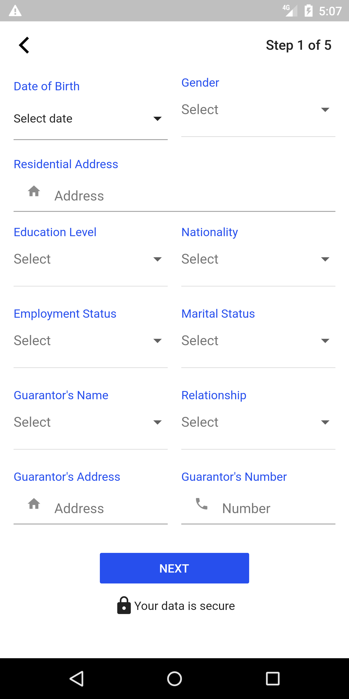

# credpal

Credpal flutter dev challenge.

> **Disclaimer:** This is a flutter developer challenge

## App
Download the `app-release.apk` to try out the release version
 
<a href="./app-release.apk"></img></a>
 

## 📸

| Images| Images|
|------|-------|
|||
|||

## Getting Started

This project is a starting point for a Flutter application.

A few resources to get you started if this is your first Flutter project:

- [Lab: Write your first Flutter app](https://flutter.dev/docs/get-started/codelab)
- [Cookbook: Useful Flutter samples](https://flutter.dev/docs/cookbook)

For help getting started with Flutter, view our
[online documentation](https://flutter.dev/docs), which offers tutorials,
samples, guidance on mobile development, and a full API reference.
